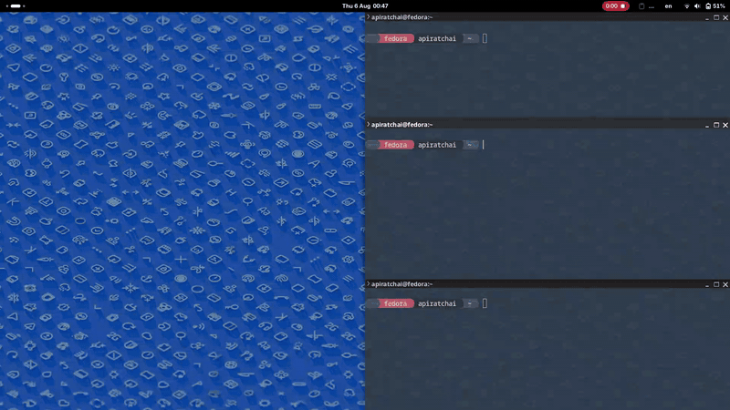

# gnome-snapnine

Window snapping for GNOME Shell, designed around the numpad.
Nine positions: halves, quarters, maximize, plus restore (float centered)
and minimize. Every action supports multiple shortcuts.

## Install

**Release zip (recommended):**

```sh
# 1. Download snapnine.zip from Releases (or snapnine-nightly.zip for nightly)
#    https://github.com/Apiratchai/gnome-snapnine/releases
gnome-extensions install snapnine.zip
```

**From source:**

```sh
git clone https://github.com/Apiratchai/gnome-snapnine.git
cd gnome-snapnine
make install && make enable
```

Log out and back in once (the shell only scans new extensions at startup),
then press `Super+Left` on any window to test.

## Use

```
  7 8 9      top-left     top-half     top-right
  4 5 6      left         maximize     right
  1 2 3      bottom-left  bottom-half  bottom-right
```

Halves/maximize/restore on `Super+Arrows`, quarters on `Super+KP_*`,
presets on `Super+Shift+1/2/3`, capture on `Super+Shift+g`.
Rebind everything in Extensions > snapnine > Settings.
Pressing a position key again restores the previous geometry.



## Why this exists

Inspired by [Tiling Assistant](https://github.com/ubuntu/Tiling-Assistant).
On Wayland the app controls its own size, so a freshly opened window
(e.g. Firefox) can resize itself just after snapping and end up in the
wrong place. snapnine waits for the window to settle, then re-applies
the snap if the app overrides it — the window lands where you told it to.

## Testing

```sh
make unit    # geometry checks, no shell needed
make live    # full suite: real windows, D-Bus, injected keypresses
```

Details: [tests/README.md](tests/README.md).

## License

GPL-2.0-or-later (see [LICENSE](LICENSE)). Developed with reference to
[tiling-assistant](https://github.com/ubuntu/Tiling-Assistant) by Leleat
(GPL-2.0-or-later); specific borrowings are credited in code comments
and in [NOTICE](NOTICE).
